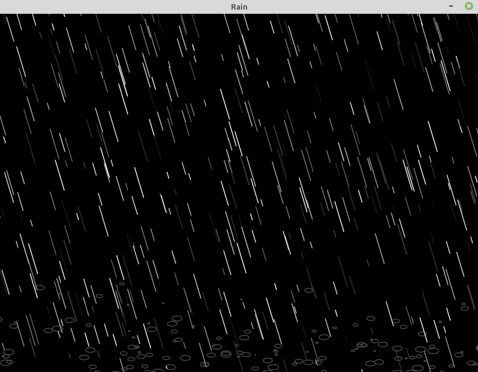

# LuaApps
Reference for small games and animations builded using Lua programming language and LÖVE game engine.

  

## Rain
GitHub Repository: https://github.com/MatheusCod/Rain
Rain simulation build with LÖVE game engine using Lua programming language.

## Stars
GitHub Repository: https://github.com/MatheusCod/Stars
A walk into the space(Starfield animation).
Simulation build with LÖVE game engine using Lua programming language.

## Particles
GitHub Repository: https://github.com/MatheusCod/Particles
Very simple particle simulation.
All particles follow the same rules.
The red and blue one are just for better observation.
